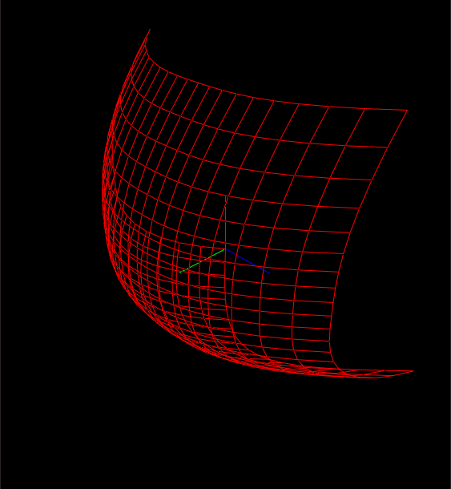

## Introduction
**XCurve is a Implementing nurbs modeling on qt.**

## Feature:
- Basis Function Computation
- NURBS Curve and Surface
- Curve and Surface Reverse
- Curve Transform
- Create Arc Curve
- Create Rotating Surface

This library is **in progress.**
